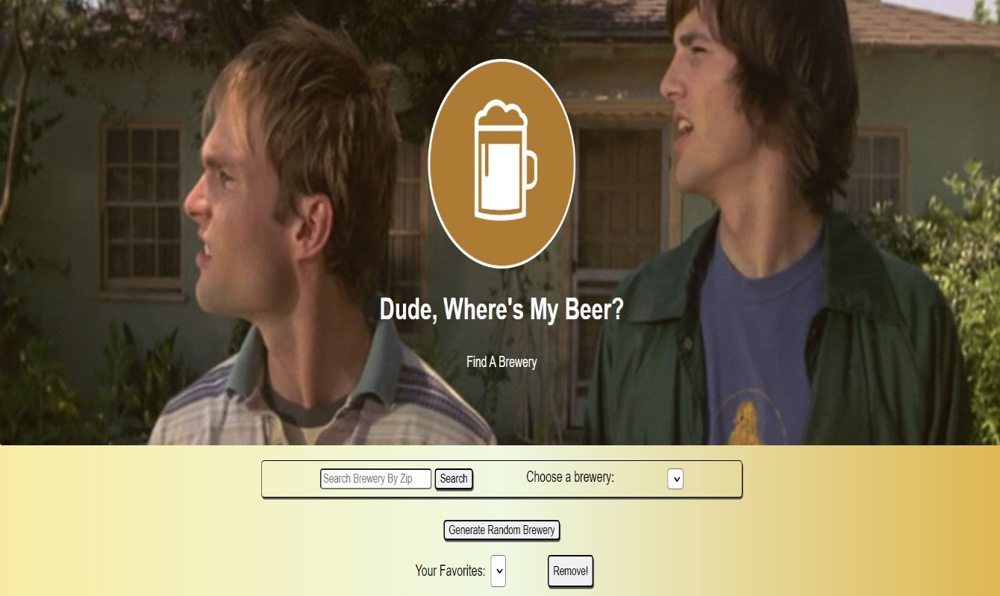

# Dude Where's My Beer?! - a web app to find breweries by the zip code

## Description:

This project was created for FlatIron Phase 1 week 3 project.
The assignment was:

1. Either make a json server or choose a public api and do some fetch requests with it -- We've choose a breweries location public api as well as created our own json local server
2. Add 3 eventListeners on the page:
   Our event listeners are: 1. Searching for breweries by zip code. 2. A details section that shows the details of a brewery based on the brewery that was selected in a dropdown menu. 3. A generate random brewery button that shows the details of a random brewery 4. A favorite button that adds the brewery that was liked to the json server and then presents it on a dropdown menu 5. Similar to 2-- just with a favorite dropdown 6. A remove button to remove favorite brewery from the favorite dropdown and the json server.

**The Application**

As specified in the event listeners, this web app allows you to look-up breweries by their zip code. You can then see the details of the brewery and you can mark your favorite brewery (as well as delete unwanted favorite breweries).

**Technologies used:**

For this project we used Javascript, HTML, CSS and JSON as the local server.

**Challenges:**

1. We only coding for about 2 weeks and a half so our knowledge was limited -- (good thing there's google ;)
2. We had a hard time figuring out how to present the brewery details based on the 'change' event listener of the dropdown. We ended up doing another fetch call based on the brewery name.
   3.The random button didn't work at first and eventually with the help of an instructor we discovered that we had to make a special fetch request: `{ cache: "no-store" }` because the server kept calling the same brewery rather than a random one.
3. We needed to understand some regex and perform some string manipulation in order to present the phone number properly and call the brewery path by name.
4. Figuring out css layout and styling

## How To Run?

To run the project, simply clone it into your computer. Open it in your browser and in your local terminal run: `json-server --watch fave-brew.json`

If you don't have json installed on your device: [How to install json server](https://www.npmjs.com/package/json-server)

Creators
---

Shane Dorsey [Gitlink](https://github.com/scdorsey22), [Linkdin](https://www.linkedin.com/in/shanedorsey/)

Lior Levy [Gitlink](https://github.com/levydlior), [Linkdin](https://www.linkedin.com/in/liordl/)